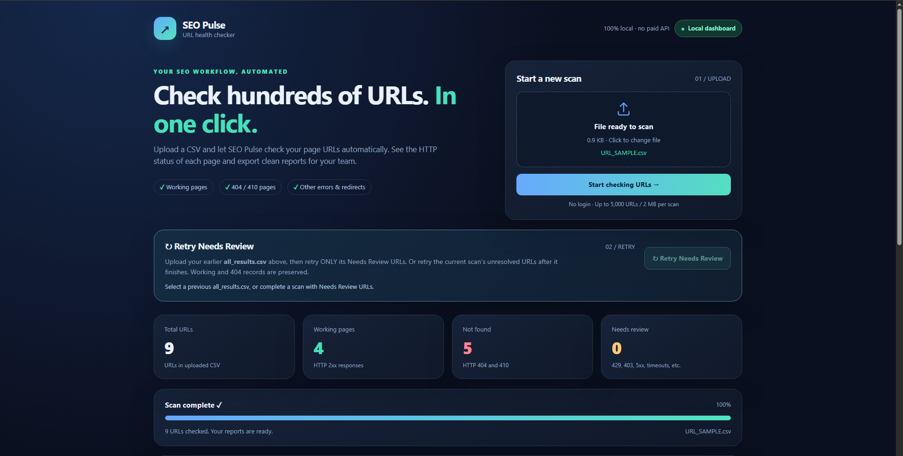
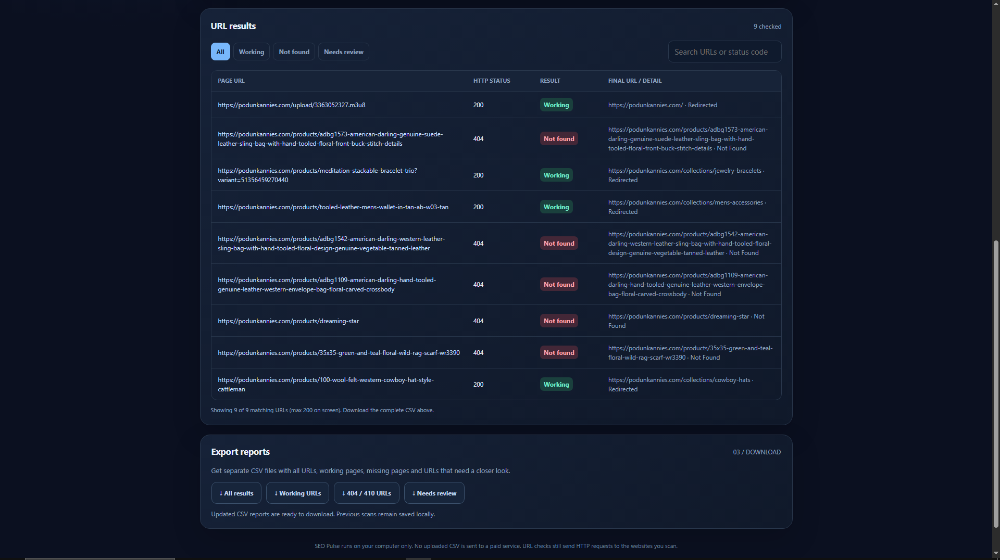

# SEO Pulse — Automated URL Checker

A free, Python-based SEO automation dashboard for bulk URL validation, HTTP status monitoring, and structured CSV reporting.

SEO Pulse helps SEO professionals and website administrators identify missing pages, verify redirects, investigate HTTP errors, and automate repetitive URL-checking workflows.

The application runs locally on your computer, without paid APIs, hosting fees, or user accounts.

**Built with Python, HTML, CSS, and JavaScript.**

---

## Dashboard Preview



### URL Results and Reports



---

## 1. Project Overview

SEO Pulse is a local web application designed to simplify the process of checking large numbers of website URLs.

Instead of manually opening hundreds of pages in a browser, users can upload a CSV file containing website links.

The application automatically checks each URL, records its HTTP response, and classifies the results.

Users can view the results through an interactive dashboard and download separate CSV reports for further SEO analysis.

SEO Pulse also includes an automated retry feature for URLs that could not be verified during the initial scan.

### The Problem

SEO teams frequently need to check hundreds of URLs to identify:

- Pages that are working.
- Pages returning 404 or 410 errors.
- URLs redirecting to other pages.
- Websites returning server errors.
- Pages that cannot be verified due to access restrictions or rate limiting.

Manually checking every URL is repetitive and time-consuming.

Additionally, some websites restrict automated requests, making it difficult to distinguish genuinely missing pages from temporarily inaccessible ones.

### The Solution

SEO Pulse automates URL checking through a simple local dashboard.

Users upload their URL list, start a scan, review the results, and export reports.

For URLs that could not be verified, the application provides a controlled retry workflow.

This reduces repetitive manual checking while keeping unresolved URLs clearly identified for further investigation.

---

## 2. Key Features

### Bulk URL Checking

Upload a CSV file containing multiple website URLs and check them automatically.

The application supports up to 5,000 URLs per scan, with a maximum CSV file size of 2 MB.

### HTTP Status Detection

Check URL responses and identify common HTTP status codes, including:

- 200 — OK
- 301 / 302 — Redirects
- 403 — Forbidden
- 404 — Not Found
- 410 — Gone
- 429 — Too Many Requests
- 500 / 503 — Server Errors

Redirects are followed, and the final destination is included in the scan results.

### Interactive Dashboard

View scan progress, summary statistics, and individual URL results through a browser-based interface.

The dashboard includes:

- Total URL count.
- Working page count.
- Not Found count.
- Needs Review count.
- Scan progress.
- URL search and result filtering.

### Automated Retry

Retry URLs that could not be verified during the initial scan without repeating checks for every URL.

The retry workflow is designed to handle temporary errors and respect website rate limits.

### CSV Reports

Download organized reports containing the original URLs, HTTP responses, final destinations, and additional information.

### Local Execution

Run the application directly on your computer.

No paid API, cloud hosting, or user account is required.

---

## 3. Technology Stack

| Technology | Purpose |
|------------|---------|
| Python 3.9+ | Backend application and URL processing |
| HTML | Dashboard structure |
| CSS | Dashboard styling |
| JavaScript | Interactive dashboard functionality |
| HTTP | URL response verification |
| CSV | URL imports and report exports |

The application uses Python's standard library and does not require additional pip packages for its core functionality.

---

## 4. Installation and Setup

### Requirements

Before starting, make sure your computer has:

- Python 3.9 or newer.
- A modern web browser.
- An internet connection for checking public website URLs.

Download Python from:

https://www.python.org/downloads/

Windows users should enable "Add Python to PATH" during installation.

### Step 1 — Download the Project

Open this repository on GitHub.

Click:

**Code → Download ZIP**

Extract the downloaded ZIP file to a folder on your computer.

Keep the project files and their original folder structure together.

### Step 2 — Start the Application

**Windows**

Double-click:

`start_windows.bat`

Alternatively, open Command Prompt inside the project folder and run:

```bash
py -3 app.py
```

**macOS / Linux**

Open a terminal inside the project folder and run:

```bash
python3 app.py
```

### Step 3 — Open the Dashboard

Open your browser and visit:

http://127.0.0.1:8765

The dashboard will run locally on your computer.

Keep the terminal window open while using the application.

### Step 4 — Stop the Application

Press `Ctrl + C` in the terminal to stop the local server.

You can start the application again whenever needed.

---

## 5. How to Use SEO Pulse

### Step 1 — Prepare Your CSV File

Create a CSV file containing the URLs you want to check.

Example:

```csv
url
https://example.com/
https://example.com/products
https://example.com/not-a-real-page
https://www.wikipedia.org/
```

Save the file with a `.csv` extension.

A single-column CSV without a header is also supported.

URLs beginning with `www.` are accepted.

### Step 2 — Upload Your CSV

Open the SEO Pulse dashboard.

Click the upload area and select your CSV file.

The dashboard will display the selected file.

### Step 3 — Start the Scan

Click:

**Start checking URLs**

The application will begin checking the uploaded URLs automatically.

You can monitor the scan progress through the dashboard.

### Step 4 — Review the Results

Once scanning is complete, review the summary cards and individual URL results.

You can filter the results by status or search for a specific URL.

### Step 5 — Download Reports

Use the Export Reports section to download the complete report or individual status categories.

The application also saves generated reports locally.

---

## 6. Understanding URL Status Results

SEO Pulse organizes scan results into three main categories.

### Working

A URL is classified as Working when its final HTTP response is within the 200–299 range.

Example:

```text
Original URL:
https://example.com/products/old-product

Final URL:
https://example.com/collections/products

HTTP Status:
200

Result:
Working
```

**Important:** A Working result does not necessarily mean the original URL returned HTTP 200 directly.

The original URL may redirect to another page that returns HTTP 200.

Always review the Final URL and Details columns when checking redirects.

A successful HTTP response also does not guarantee that the page displays the intended content.

### Not Found

The Not Found category includes:

- HTTP 404 — Page Not Found.
- HTTP 410 — Page Gone.

These responses indicate that the requested resource is unavailable at the checked URL.

Example:

```text
URL:
https://example.com/products/missing-product

HTTP Status:
404

Result:
Not Found
```

SEO teams can investigate these URLs to determine whether the pages should be restored, redirected, or otherwise handled.

### Needs Review

The Needs Review category contains URLs whose availability could not be confidently confirmed.

This includes:

- HTTP 403 — Forbidden.
- HTTP 429 — Too Many Requests.
- HTTP 500 / 503 — Server Errors.
- Connection timeouts.
- Network failures.
- Invalid or inaccessible URLs.

**Needs Review does not automatically mean that a page is broken.**

Some websites restrict automated HTTP requests even when their pages work normally in a browser.

These URLs should be verified further before making SEO changes.

---

## 7. Automatic Retry — Needs Review

One of SEO Pulse's key features is its controlled retry workflow.

When the initial scan encounters temporary errors, some URLs may remain unresolved.

Instead of manually opening every unresolved URL, users can retry those URLs automatically.

### Method 1 — Retry the Current Scan

1. Upload your original URL CSV.
2. Complete the initial scan.
3. Review the Needs Review count.
4. Click **Retry Needs Review**.
5. Wait for the retry process to finish.
6. Download the updated reports.

Only eligible unresolved URLs from the current scan are retried.

### Method 2 — Import an Existing Report

SEO Pulse also supports retrying unresolved URLs from a previous scan.

This is useful when an earlier report contains a large number of Needs Review results.

**Step 1**

Open the SEO Pulse dashboard.

**Step 2**

Upload the `all_results.csv` file from your previous scan.

Do not upload `needs_review.csv` for this workflow.

The complete report is required to preserve the existing results of other URLs.

**Step 3**

Click **Retry Needs Review**.

The application identifies the rows marked `needs_review` and retries those URLs.

**Step 4**

Wait for the retry operation to finish.

**Step 5**

Download the refreshed All Results CSV and the updated category reports.

Previously classified Working and Not Found results are preserved.

Only eligible Needs Review URLs receive new HTTP checks.

---

## 8. How Rate-Limit Protection Works

Some websites restrict the number of automated requests they accept.

When too many requests are sent, a website may return:

**HTTP 429 — Too Many Requests**

SEO Pulse includes rate-limit-aware retry handling to reduce repeated requests to restricted websites.

### Controlled Retry Behavior

During the retry process:

1. URLs are checked sequentially.
2. The application waits at least five seconds between requests to the same host.
3. If a URL returns HTTP 429, the application checks the website's `Retry-After` response.
4. The URL may be retried once after the required delay, provided the requested wait does not exceed 120 seconds.
5. If the website requests a longer delay or returns HTTP 429 again, further requests to that host stop for the current retry job.

Remaining URLs from the affected host are marked as not retried and remain under Needs Review.

The report distinguishes URLs that were actually checked from those skipped due to rate limiting.

### Important Limitation

Retry does not bypass website security restrictions.

If a website continues to reject automated requests, SEO Pulse cannot guarantee a definitive result.

For websites managed by your organization, contact the website administrator for approved automated access or server-side information.

When checking third-party websites, obtain appropriate permission and respect their access restrictions and rate limits.

---

## 9. Exported Reports

SEO Pulse generates four CSV reports.

| Report | Description |
|--------|-------------|
| all_results.csv | Complete list of checked URLs and their results |
| working.csv | URLs classified as Working |
| not_found.csv | URLs returning HTTP 404 or 410 |
| needs_review.csv | URLs requiring additional verification |

The complete report includes information such as the original URL, HTTP status, final URL, classification, and available details.

Reports are saved automatically in the local project folder:

```text
reports/
    scan_id/
        all_results.csv
        working.csv
        not_found.csv
        needs_review.csv
```

Each scan has its own report directory.

Previous reports remain available locally when a new scan or retry is completed.

Generated reports are not automatically uploaded to GitHub.

---

## 10. Project Structure

```text
seo-pulse-url-checker/
|
|-- app.py
|-- seo_url_checker.py
|-- static/
|   |-- index.html
|
|-- sample_urls.csv
|-- start_windows.bat
|-- start_mac_linux.sh
|-- README.md
|-- .gitignore
|
|-- dashboard.PNG
|-- results.PNG
|
|-- reports/             # Generated locally
```

### Main Files

**app.py**

Runs the local web server and handles dashboard operations.

**seo_url_checker.py**

Contains URL checking and result-processing functionality.

**static/index.html**

Contains the dashboard interface.

**sample_urls.csv**

Provides example URLs for testing the application.

**start_windows.bat**

Starts the application on Windows.

**start_mac_linux.sh**

Startup script for macOS and Linux.

**reports/**

Stores locally generated CSV reports.

---

## 11. Changing the Localhost Port

The default dashboard address is:

http://127.0.0.1:8765

If another application is already using port 8765, you can choose a different port.

On Windows Command Prompt, run:

```bat
set SEO_DASHBOARD_PORT=8766
py -3 app.py
```

Then open:

http://127.0.0.1:8766

This allows SEO Pulse to run alongside other local applications using different ports.

---

## 12. Limitations

SEO Pulse is designed for automated HTTP URL verification, not complete browser-based website testing.

Please consider the following limitations:

- Some websites block automated requests.
- A URL may work in a normal browser but return HTTP 403 or 429 to the checker.
- A server may return HTTP 200 even when the displayed page contains an error message.
- A redirected URL may be classified as Working when its final destination returns HTTP 200.
- JavaScript-rendered page content is not fully evaluated.
- Some URLs require manual investigation or access to server-side information.

The initial scan uses four parallel workers.

For websites that apply rate limits, the controlled Retry Needs Review feature is preferable to repeatedly starting full scans.

The application runs on your local computer and is not a publicly hosted website.

---

## 13. Project Purpose

SEO Pulse was developed to explore how practical automation can simplify repetitive SEO operations.

The project focuses on:

- Python backend development.
- HTTP request processing.
- Web dashboard development.
- CSV data handling.
- Automated error classification.
- Retry and rate-limit handling.
- Workflow automation.

The goal is to provide SEO professionals and website administrators with a simple, reusable tool for everyday URL auditing.

---

## Author

**Saad Ahmed**

GitHub: [Saadi84](https://github.com/Saadi84)

Project: [SEO Pulse — Automated URL Checker](https://github.com/Saadi84/seo-pulse-url-checker)

---

**SEO Pulse — Making repetitive URL checking simpler through automation.**
